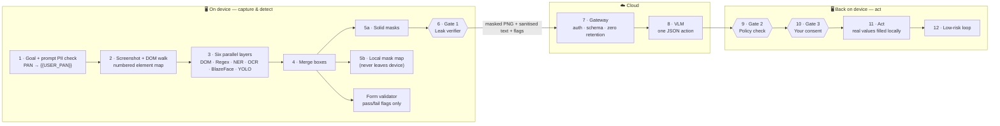

<div align="center">

# 🛡️ SafeScreen

### A browser agent that hides your private data *before* the cloud ever sees it

**Smart India Hackathon 2026 · PS 26171 — On-device Visual Perception for Light-weight Browser Agents**
Ministry: ISRO / Department of Space · Theme: Smart Automation · Team **Mentors_&_Minions_62** (ID 145629)


**[▶ Watch the demo video](#-demo-video)** · [How it works](#-how-it-works) · [Run it](#-run-it) · [Demo scenarios](#-demo-scenarios) · [Tests](#-tests)

</div>

---

## 🎬 Demo video

> **📺 Video: _coming soon_** — `<!-- VIDEO_LINK: paste the YouTube / Drive link here -->`
>
> 5-minute walkthrough: the problem, the technical approach, and the live prototype registering a visitor on a (mock) SDSC SHAR Launch View Gallery portal — while the cloud only ever sees black boxes.

---

## ❓ The problem

AI browser agents work by **taking a screenshot of your screen and sending it to a cloud model**. One screenshot can contain passwords, Aadhaar and PAN numbers, faces, bank accounts and OTPs — all leaving the device as raw pixels. That is why banks, hospitals and government portals ban cloud AI agents, and why the **DPDP Act 2023** (penalties up to ₹250 crore per breach) makes data minimisation mandatory.

For ISRO the stakes are higher: operational and employee screens must not cross foreign cloud boundaries.

## 💡 Our answer — *hide first, ask the cloud second*

SafeScreen runs **six detection layers inside the browser**, blacks out every sensitive region with solid masks, re-verifies the result, and only then lets a cloud vision-language model see the screen. The model replies with one JSON action, which SafeScreen checks against a policy, shows to you for approval, and executes locally — filling in your real values on your own device.

| What the page shows | What the cloud receives |
|---|---|
| Name, mobile, email, PAN, an uploaded PAN card and a photo | `[NAME]` `[PHONE]` `[EMAIL]` `[PAN_NO]` `[FACE]` `[QR_CODE]` `[SIGNATURE]` … and your goal as *"my PAN is `{{USER_PAN}}`"* |

---

## ⚙️ How it works



### The six on-device layers (Step 3)

| Layer | What it catches | Runs on | Code |
|---|---|---|---|
| **L1 · DOM rules** | password, PAN, Aadhaar, OTP, card, bank-account and file-upload fields | JavaScript | [`dom_layer.js`](extension/lib/detectors/dom_layer.js) |
| **L2 · Regex + checksums** | PAN, Aadhaar (Verhoeff), cards (Luhn), phones, email, IFSC, accounts, DOB, OTP, ISRO employee IDs | JavaScript | [`pii_regex.js`](extension/lib/pii_regex.js) |
| **L3a · NER** | person names in text and field values — DistilBERT-NER (int8, 66 MB) | WASM | [`ner.js`](extension/lib/detectors/ner.js) |
| **L3b · OCR** | text inside images: PAN/Aadhaar numbers, names, dates — Tesseract | WASM | [`ocr.js`](extension/lib/detectors/ocr.js) |
| **L4 · BlazeFace** | faces in photos and video frames — MediaPipe | GPU (WebGL) | [`face.js`](extension/lib/detectors/face.js) |
| **L5 · YOLO-nano** | PAN/Aadhaar card regions: number, photo, name, DOB, signature, QR — trained on synthetic cards | **WebGPU** | [`yolo.js`](extension/lib/detectors/yolo.js) |

### Three safety gates

- **Gate 1 — Leak verifier** (fail-closed): re-runs OCR, regex, NER and face detection on the *masked* image, checks every mask is really solid, re-masks once, and blocks the send if anything is still readable. → [`leak_verifier.js`](extension/lib/leak_verifier.js)
- **Gate 2 — Policy check**: schema + allow-list; masked fields accept only a matching placeholder; password/payment fields can never be filled; nothing in a web page can widen these rules. → [`policy.js`](extension/lib/policy.js)
- **Gate 3 — Consent + change guard**: every state-changing action needs your click on **Approve**; editing any field voids the approval. → [`content.js`](extension/content/content.js)

**Built for the ISRO workspace:** the agent only runs on approved origins (`*.isro.gov.in`, `*.shar.gov.in`, `*.nrsc.gov.in`, … and the bundled mock portal) — see [`config.js`](extension/lib/config.js).

---

## 🚀 Run it

**Prerequisites:** Node 18+, Python 3.10+, Chrome 116+

```bash
# 1. on-device runtimes (ONNX Runtime, Transformers.js, MediaPipe, Tesseract)
cd prototype
npm install
npm run vendor

# 2. gateway + mock ISRO portal
cd gateway
pip install -r requirements.txt
cp .env.example .env          # VLM_PROVIDER=mock works offline; set anthropic + ANTHROPIC_API_KEY for a real model
uvicorn app.main:app --port 8000
```

3. **Load the extension:** `chrome://extensions` → **Developer mode** → **Load unpacked** → select `prototype/extension`.
4. Open **http://localhost:8000/portal/**, click the SafeScreen toolbar icon, wait until the four models say **ready**, pick a sample task and press **Run agent**.
5. Approve each action on the consent card that appears on the page.

> The first run downloads the NER weights (66 MB) once; the browser caches them.

### Choosing the cloud model

| `VLM_PROVIDER` | Model | Use |
|---|---|---|
| `mock` | rule-based planner | offline demos and tests — no key needed |
| `anthropic` | `claude-opus-5` (set `ANTHROPIC_API_KEY`) | prototype with a real vision model |
| `openai_compat` | Qwen2.5-VL on vLLM / any OpenAI-compatible host | target deployment, India-hosted or on-prem |

---

## 🧪 Demo scenarios

All data on the mock portal is synthetic (AI-generated faces, checksum-valid but fabricated numbers).

| Page | Try | What it shows |
|---|---|---|
| 🚀 `lvg.html` — Launch View Gallery | *"Register me … My name is Meera Iyer, mobile 9812345670 … PAN BQJPI4821K. Then submit."* | PAN card image fully masked; name, phone, email and PAN typed via placeholders after consent; form submitted |
| 🔬 `respond.html` — RESPOND | *"Fill the bank details … account number 50100234567812 and IFSC SBIN0001234"* | bank details never sent; investigator's name, phone and email masked |
| 🔐 `login.html` — Single Sign-On | *"Sign me in with employee ID ISRO-SAC-20417."* | strict mode: no screenshot sent; password and OTP left to the user |
| ⚠️ `notice.html` — Circulars | *"Summarise the circulars on this page."* | the page hides a prompt-injection; a destructive click still needs your approval |

---

## ✅ Tests

```bash
npm test                                   # regex & checksums, merge, policy, DOM rules, workspace allow-list
cd gateway && python -m pytest -q tests    # auth, schema, 400/413 handling, strict mode, no input echo
node tests/e2e.mjs lvg                     # full run of the real extension in Chrome for Testing (gateway running)
```

End-to-end screenshots and the exact outgoing payload land in `tests/out/`.

## 🗂️ Project layout

```
prototype/
├── extension/          Chrome MV3 extension — side panel, content script, on-device detectors, models
├── gateway/            FastAPI gateway + VLM providers (anthropic · openai_compat · mock)
├── portal/             mock ISRO Employee Services Portal (synthetic data)
├── tools/              vendoring, synthetic ID-card generator, YOLO training/export, demo recording
├── tests/              unit tests + end-to-end browser run
└── assets_src/         AI-generated faces used for the synthetic cards
```

### Re-training the ID-card detector (Layer 5)

```bash
python -m venv training/.venv && training/.venv/Scripts/pip install ultralytics onnx onnxslim pillow
training/.venv/Scripts/python tools/gen_cards.py yolo --n 1500     # synthetic PAN / Aadhaar cards
training/.venv/Scripts/python tools/train_yolo.py --epochs 12      # → extension/models/yolo_idcard.onnx
```

---

## 📌 Current limitations

- Chrome only for now (side-panel API); the Firefox port is planned.
- Each cycle takes roughly 8–12 s on CPU, mostly OCR; WebGPU OCR and a hosted Qwen2.5-VL are the path to the latency targets.
- NER runs on WASM (its int8 weights misbehave on WebGPU); YOLO runs on WebGPU.
- The YOLO detector is trained on synthetic cards only.
- The gateway runs over HTTP on localhost in the prototype; production needs TLS 1.3.

---

<div align="center">

### 👥 Team Mentors_&_Minions_62

Kartik Mantri · Aryan Mehta · Mriganka Kothari · Aditya Gupta · Alakshendra · Navya Jain

*"We didn't invent any of this. We just made it private."*

</div>
